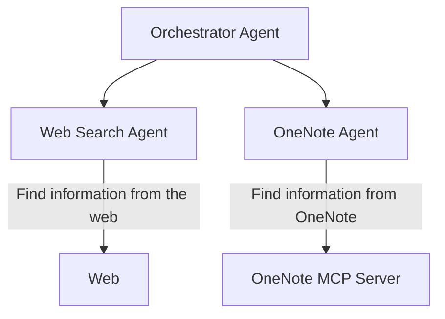

# About this project
This project shows how [OpenAI Agents SDK](https://openai.github.io/openai-agents-python/) can be used to create an Orchestrator Multi-Agent.

It's not created to be a reference or a guideline for anyone, it's only purpose it's my own learning.

The main goal of this Orchestrator Multi-Agent is to work as an assistant for helping tracking my AI learning. For that purpose, it's using my [One Note MCP Server](https://github.com/Kalm004/learning-onenote-mcp-server).

## Architecture

The diagram above shows the architecture: the Orchestrator Agent coordinates two other agents. The Web Search Agent handles queries by searching online, while the OneNote Agent retrieves information from your OneNote notes via the OneNote MCP Server.


# Running this project

For running this project you need to provide an `.env` file with the following properties:
```
OPENAI_API_KEY=<OPENAI Api Key to be used by this agent>
ONENOTE_MCP_PYTHON_PATH=<path to the Python instance to be used for running One Note MCP>
ONENOTE_MCP_SCRIPT_PATH=<path of the server.py file inside the One Note MCP>
```